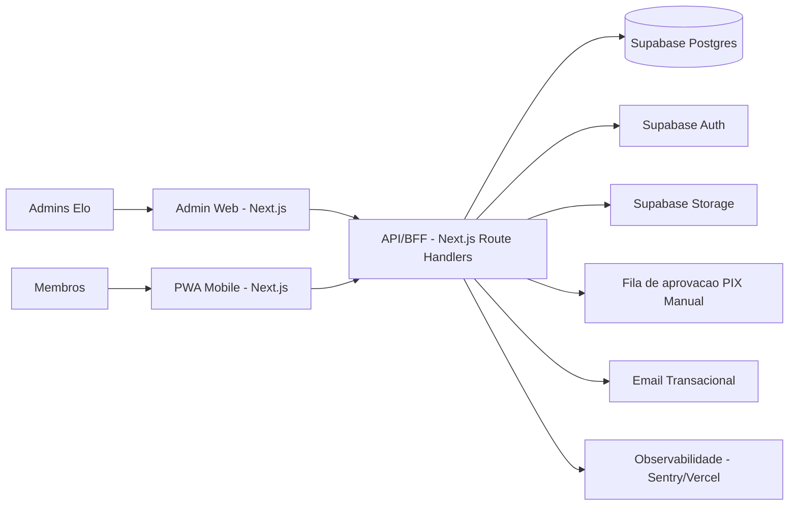
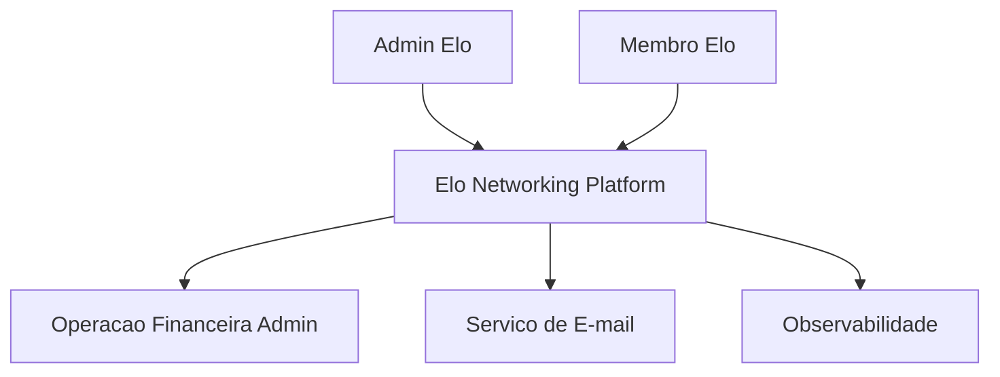
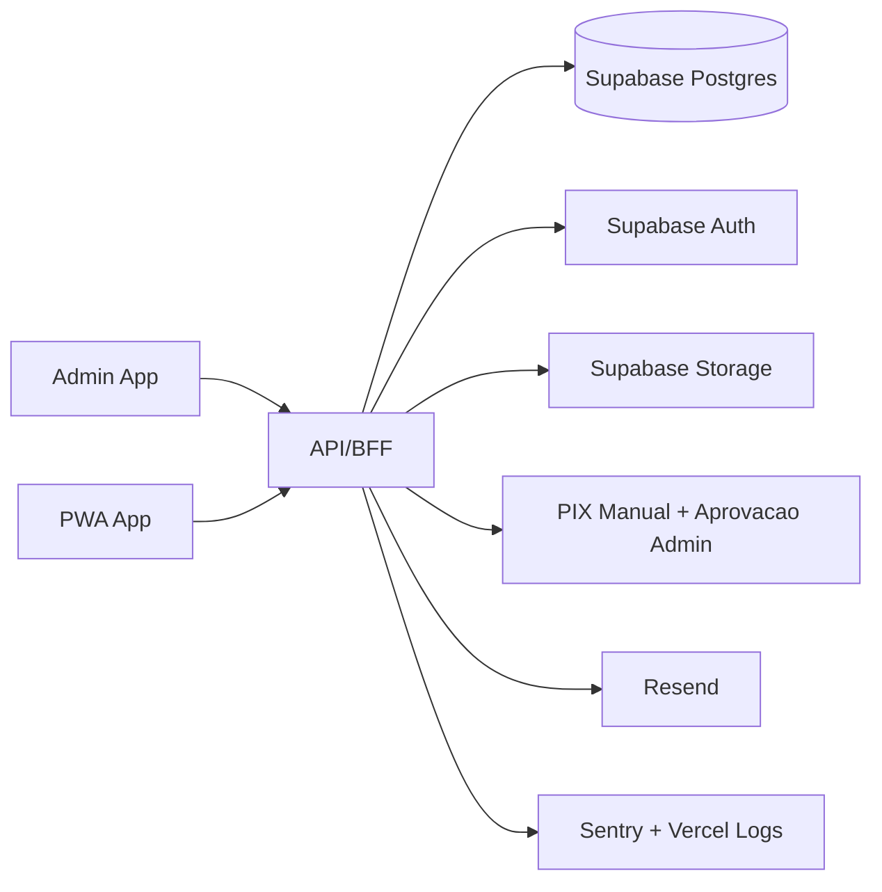
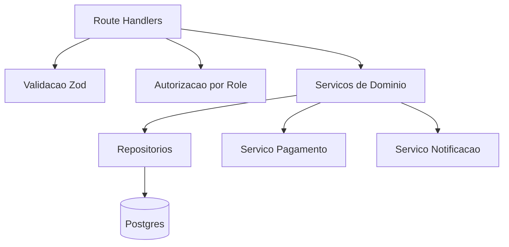

# Arquitetura - HLD, LLD e C4

## HLD (High-Level Design)

## LLD (Low-Level Design)

### Módulos
- `apps/admin`: UI administrativa, dashboards e CRUDs principais.
- `apps/pwa`: UI mobile-first para membros, com navegacao inferior.
- `apps/api`: contrato REST interno e regras de negocio.
- `packages/core`: tipos, schemas e contratos.
- `packages/ui`: design tokens e componentes visuais.

### Fluxos principais
1. Login: `pwa/admin -> api/auth/login -> Supabase Auth`.
2. Gestao membro: `admin -> api/admin/members -> Postgres`.
3. Eventos: `admin create -> app list -> confirmacao membro`.
4. Gamificacao: `admin lanca pontos -> ranking atualizado`.
5. Pagamento: `checkout -> qr pix dinamico -> aprovacao admin -> confirmacao de presenca`.

### Limites de domínio
- Dominio Membros/Financeiro
- Dominio Eventos
- Dominio Gamificacao
- Dominio Networking (elos, projetos)

## C4 - Context

## C4 - Container

## C4 - Component (API)

